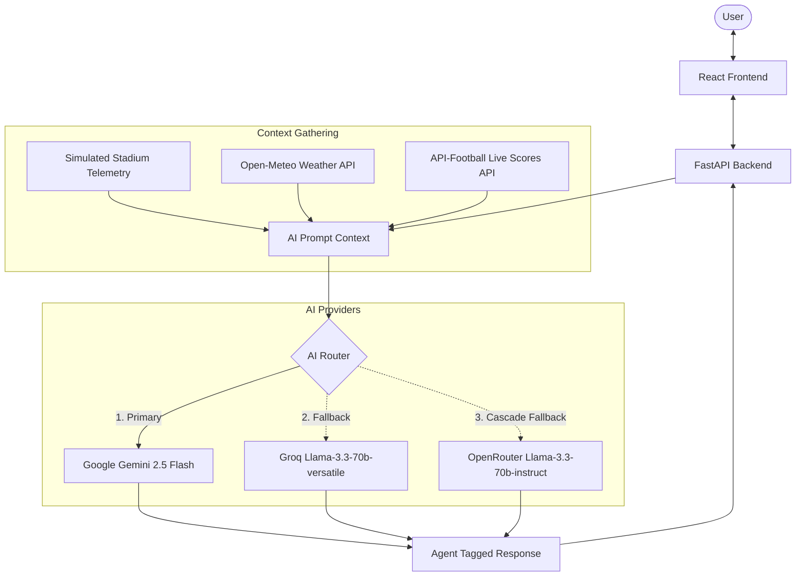
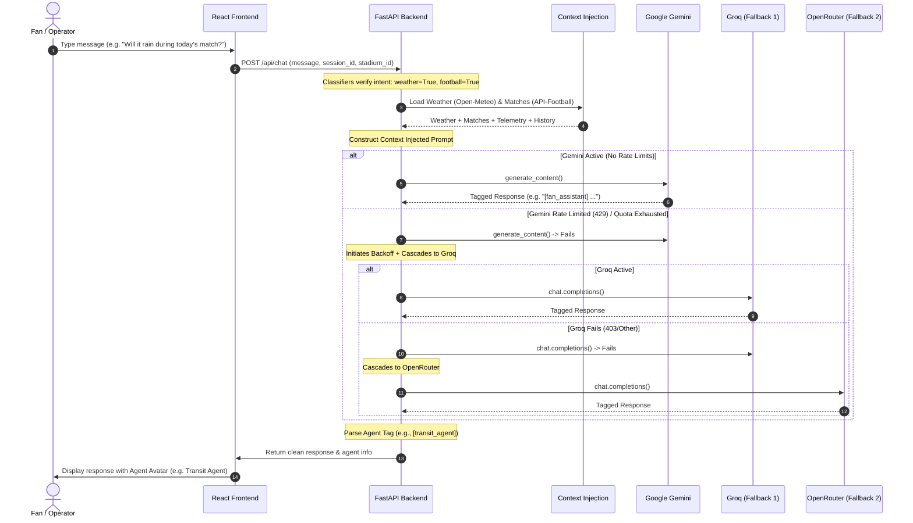

# StadiumQ — FIFA World Cup 2026 AI Command Center

StadiumQ is an AI-powered operational command center and guest concierge designed for the FIFA World Cup 2026. Built for fans, operations staff, and transit planners, the application merges live simulated stadium telemetry (crowd flows, gate queue wait times, parking availability, restroom wait times, incidents) with real-world weather conditions (Open-Meteo) and live football matches, scores, group standings, cards, and goals (API-Football). 

The platform leverages a robust, multi-tier GenAI pipeline that coordinates six specialized AI personas to deliver context-aware stadium navigation, crowd mitigation, and operational safety recommendations.

---

## 📌 Problem Statement
Managing a major tournament like the FIFA World Cup 2026 across 16 different venues presents immense logistics and safety challenges. Operations staff are often siloed from real-time crowd dynamics, and fans struggle with navigating long restroom/concession lines, parking surge rates, transit delays, and weather changes. Isolated weather forecasts or raw sports schedules do not help unless they are combined into **actionable stadium operational intelligence** (e.g. warning fans about an exit gate because a match is ending and heavy rain is starting).

## 💡 Solution
StadiumQ solves this by building an AI-powered console that aggregates:
1. **Simulated Stadium Telemetry**: Live zone occupancy, exit gate wait times, security alerts, queue times.
2. **Real-time Weather Data (Open-Meteo)**: Current temp, rain probability, wind speed, relative humidity, and 3-day forecasts.
3. **Live Football Data (API-Football)**: Real-time match fixtures, live scores, stage progress, goals, cards, and dynamic group standings.
4. **Conversation History**: Short-term persistent session memory.

It feeds this unified context into a specialized AI pipeline that adopts the voice of the most relevant operational persona (Fan Services, Crowd Intelligence, Accessibility Concierge, Transit & Transport, Sustainability Hub, or Operations Management) to generate intelligent recommendations.

---

## 🏗 Architecture Diagram



---

## 🔄 AI Workflow (Sequence Diagram)



---

## 🌟 Key Features

* **Multi-Provider AI Fallback Routing**: Guarantees high availability by cascading from Google Gemini to Groq and OpenRouter when rate limits or quotas are hit, maintaining zero chat downtime.
* **Intelligent Query Classifiers**: Only queries weather or football endpoints when the query depends on them, preventing API overhead and reducing token sizes.
* **Live Dynamic Standings**: Computes tournament group stage standings (points, wins, goal differences) in real-time, mapping match updates instantly.
* **Specialized Operational Personas**: Coordinates 6 distinct agent tags (e.g. `[fan_assistant]`, `[crowd_agent]`, `[accessibility_agent]`) depending on the context.
* **Dark Stadium Map visualizer**: Renders facilities, restrooms, entrances, and recycling bins dynamically over real-world coordinates via Leaflet.js.
* **Multilingual Support**: Supports English (`en`), Spanish (`es`), French (`fr`), Arabic (`ar`), and Hindi (`hi`).

---

## 🛠 Technology Stack

* **Frontend**: React (Vite), Leaflet.js Maps, Vanilla CSS.
* **Backend**: FastAPI (Python), Uvicorn server, SQLite3 (persistent chat history).
* **AI Engine**: Google GenAI SDK, REST integrations for Groq and OpenRouter.
* **APIs**: Open-Meteo API (weather), API-Football (v3 fixtures and events).
* **CORS Middleware**: Configured to run on standard localhost development ports (`5173` and `8000`).

---

## 📁 Folder Structure

```
FIFA/
├── weather_football_service.py # Weather/Match fetchers, caches, and standings
├── unified_agent.py           # GenAI cascade routing, system prompts, history
├── tools.py                   # Python tools exposed to primary Gemini model
├── data.py                    # Static stadium coordinate assets & match seeds
├── main.py                    # FastAPI routes, WebSocket telemetry, CORS configs
├── schema.py                  # Pydantic schema validation structures
├── verify_integration.py      # Automated integration verification test suite
├── start.bat                  # Multi-process launch script for local running
└── frontend/                  # React Vite client code
    ├── src/
    │   ├── App.jsx            # Core layout routing
    │   ├── components/        # Sidebar, Header, ChatPanel, StadiumMap, Dashboards
    │   └── utils/api.js       # Client HTTP fetch utilities
    └── package.json
```

---

## 🚀 Installation & Running Locally

### Prerequisites
* Python 3.10+
* Node.js 18+

### 1. Clone the repository and install Backend
From the root directory:
```bash
pip install -r requirements.txt
```

### 2. Configure Environment Variables
Create a `.env` file in the root directory:
```env
GEMINI_API_KEY=your_gemini_api_key
GROQ_API_KEY=your_groq_api_key
OPENROUTER_API_KEY=your_openrouter_api_key
OPENROUTER_MODEL=meta-llama/llama-3.3-70b-instruct
FOOTBALL_API_KEY=bf4edbdc9c03e58de50fb413df362def
```

### 3. Install Frontend Dependencies
```bash
cd frontend
npm install
cd ..
```

### 4. Launch the Application
Run the startup script in the root directory:
```cmd
start.bat
```
* **Frontend**: [http://localhost:5173/](http://localhost:5173/)
* **Backend API**: [http://localhost:8000/](http://localhost:8000/)
* **API Docs**: [http://localhost:8000/docs](http://localhost:8000/docs)

---

## 🔮 Future Enhancements
* **3D Indoor Navigation**: Integrate WebGL/Three.js maps for multi-level indoor seat navigation.
* **Live CCTV Anomaly Detection**: Connect local cameras with vision models (e.g. Gemini 2.5 Flash) to report safety incidents or long food court queues automatically.
* **NFC Ticketing and Wallet integration**: Combine digital gates with fan wallet IDs to recommend entrance lanes dynamically.

---

## 📄 License
This project is licensed under the MIT License.
