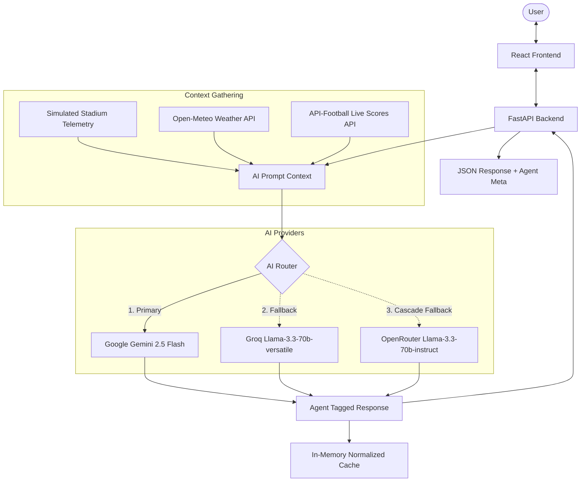
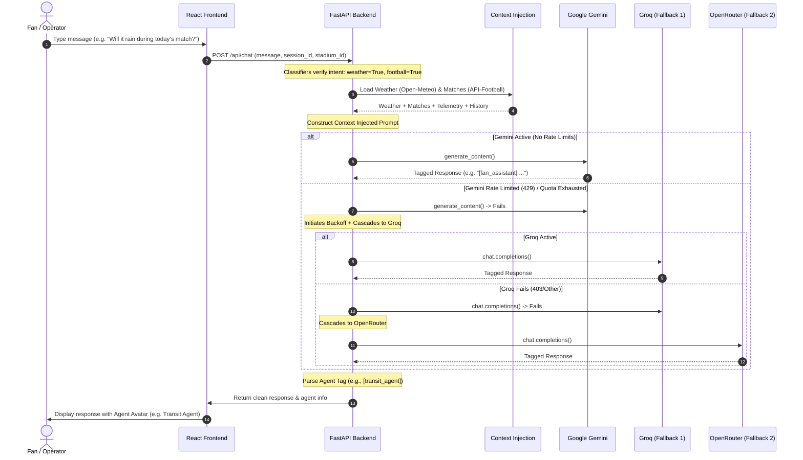

# StadiumIQ — FIFA World Cup 2026 AI Command Center

StadiumIQ is a GenAI-powered operational command center and guest concierge designed for the FIFA World Cup 2026. Designed for fans, stadium operations staff, and transit planners, the application acts as an intelligent digital assistant that connects real-time venue status with tournament statistics and environmental conditions.

The platform was built to tackle the massive logistical challenges of hosting a global sporting event across 16 different North American stadiums. By transforming siloed telemetry into unified operational intelligence, StadiumIQ helps fans navigate facilities smoothly, assists visitors with accessibility requirements, and helps operations teams manage incidents in real time.

For demonstration purposes, stadium telemetry (such as queue lengths, zone densities, restroom wait times, and security incidents) is simulated. Weather conditions are pulled live from the Open-Meteo API, match fixtures and standings are sourced live from API-Football, and AI reasoning is handled via Google Gemini with automatic cascading fallbacks to Groq and OpenRouter.

---

## 📌 Project Highlights
- **Multi-Provider AI Fallback Routing**: Ensures continuous availability of the AI concierge by automatically cascading queries to Groq and OpenRouter if primary API limits or quotas are reached.
- **Context-Injected Personas**: Orchestrates six specialized operational personas (Fan Services, Crowd Intelligence, Accessibility, Transit, Sustainability, and Operations) to tailor recommendations.
- **Intelligent Query Classification**: Reduces API latency and token usage by pre-classifying user intent to fetch external weather or football data only when required.
- **WCAG 2.1 AA Accessibility**: Features keyboard-navigable layouts, visible focus states, screen reader ARIA labels, live-log updates, and a skip-to-content helper.
- **Extensively Tested**: Ships with a suite of 74 automated unit, integration, and security tests covering all endpoints and sanitization layers.

---

## ⚠️ The Problem Statement
Managing a major tournament across 16 massive venues presents immense logistics, transit, and safety challenges. Operations staff are often disconnected from real-time crowd movements, while fans struggle to find low-congestion gate exits, estimate parking pricing, locate sensory rooms, or find accessible pathways. Raw weather forecasts or sport fixture schedules are not useful unless they are consolidated into **actionable stadium intelligence** (for example, advising a fan to leave early via a specific gate because heavy rain is starting as the match concludes).

---

## 💡 The Solution
StadiumIQ solves these challenges by combining multiple operational data streams into a unified context window:
1. **Simulated Stadium Telemetry**: Live zone occupancy percentages, queue times, and active incident events.
2. **Live Weather Integration**: Current temperatures, rain probability, wind speeds, and relative humidity.
3. **Live Football Data**: Dynamic standings, active fixtures, scores, goals, and cards.
4. **Conversation History**: Persistent, session-based context memory.

By feeding this context to specialized AI agents, StadiumIQ generates location-aware, highly personalized recommendations for fans and coordinators alike.

---

## 🏗 Architecture & AI Workflow

### Architecture Diagram


### AI Workflow Sequence


---

## ⚡ Features

### AI Features
- **Persona Cascades**: Resolves user queries into distinct agent avatars: `[fan_assistant]`, `[crowd_agent]`, `[accessibility_agent]`, `[transit_agent]`, `[sustainability_agent]`, and `[ops_agent]`.
- **Intelligent LLM Cascade**: Cascades dynamically through secondary API endpoints (Groq, OpenRouter) to minimize downtime if rate limits or quota boundaries are encountered on the primary Gemini API.

### Fan Experience
- **Interactive Map**: A visual Leaflet.js layout showing entrances, restrooms, first aid, and food courts over real GPS coordinates.
- **Multilingual Support**: Supports full localization in English (`en`), Spanish (`es`), French (`fr`), Arabic (`ar`), and Hindi (`hi`).
- **Match schedules**: Interactive schedule view displaying group stages, timing, and scoreboards.

### Stadium Operations
- **Incident Logger**: A portal to report spills, crowd bottlenecks, or medical concerns with active responder assignments.
- **Task Dispatcher**: Operates staff deployments, tracking shift morale, task urgency, and cleaning/security assignments.

### Accessibility
- **Ramp & Elevator directions**: Provides step-by-step route planning to sections.
- **Sensory Quiet Zones**: Locates noise-isolated rooms with available capacity indicators.
- **Companion Request**: Connects fans with blue-vest navigation volunteers on-site.

### Sustainability
- **Footprint Calculator**: Measures the environmental cost of different travel options to encourage low-emission transport.
- **Composting Guide**: Visualizes recycling depots and details accepted materials.

### Live Data & Reliability
- **Intent-based Classifiers**: Inspects keywords to skip external queries when weather or football updates are irrelevant.
- **In-Memory Cache**: Normalizes incoming query keys to return immediate answers for frequent inquiries, protecting downstream API rate allocations.

---

## 🛡️ AI Architecture & Fallback Routing
To maintain reliable operation under high load, StadiumIQ uses a multi-provider fallback strategy:
1. **Primary Provider (Google Gemini)**: Gemini 2.5 Flash is used for its fast response times, natural reasoning, and native SDK support.
2. **First Fallback (Groq)**: If Gemini returns a rate-limit error (429) or quota threshold, requests are routed to Llama 3.3 70B on Groq.
3. **Second Fallback (OpenRouter)**: If both Gemini and Groq fail, requests cascade to OpenRouter.

---

## 📡 Live Data Sources & Integrations
- **Weather Information**: Sourced from the **Open-Meteo API** (using coordinates of the active stadium) with an internal cache to avoid duplicate HTTP requests.
- **Football Statistics**: Live fixtures, dynamic group standings, scores, goals, and cards are fetched from **API-Football**.
- **Stadium Telemetry**: Simulated via mock generators (`data.py`) to model realistic gate wait times, concessions status, and incident reports.

---

## 🛠 Technology Stack

| Layer | Technology | Key Usage |
|---|---|---|
| **Frontend** | React (Vite), Vanilla CSS | UI/UX dashboard & views |
| **Mapping** | Leaflet.js, OpenStreetMap | GPS coordinates rendering |
| **Backend** | FastAPI, Python | Server routing & WebSockets |
| **Database** | SQLite3 | Persistent chat history |
| **AI Client** | Google GenAI SDK | Primary inference model |
| **Testing** | Pytest, Pytest-Asyncio | Test suite validation |

---

## 📁 Folder Structure
```
StadiumIQ-GenAI/
├── main.py                     # FastAPI routes, WebSocket server, rate limiting, and CORS
├── unified_agent.py            # AI fallback cascades, prompt sanitization, history manager
├── tools.py                    # Python tool functions exposed to the AI model
├── data.py                     # Coordinates, simulated telemetry, and seed matches
├── schema.py                   # Hardened Pydantic request/response validation schemas
├── weather_football_service.py # Live Open-Meteo & API-Football wrappers and standings logic
├── pytest.ini                  # Pytest configuration settings
├── requirements.txt            # Pinned package dependency manifest
├── start.bat                   # Startup process script for local execution
├── tests/                      # Automated test suite
│   ├── conftest.py             # Test client sharing config
│   ├── test_api.py             # 74 automated unit, security, and integration tests
│   └── __init__.py             # Test module declaration
└── frontend/                   # React Vite project directory
    ├── package.json            # Node scripts and dependencies
    └── src/
        ├── App.jsx             # Main container shell and router
        ├── index.css           # Global dark glassmorphism CSS & focus rules
        ├── components/         # ChatPanel, Sidebar, Header, StadiumMap, dashboards
        └── utils/
            └── api.js          # Browser API client config
```

---

## 🚀 Installation & Running Locally

### Prerequisites
- Python 3.10+
- Node.js 18+

### 1. Install Backend Dependencies
Run the following from the root directory:
```bash
pip install -r requirements.txt
```

### 2. Configure Environment Variables
Create a `.env` file in the root directory:
```env
GEMINI_API_KEY=your_gemini_api_key
GROQ_API_KEY=your_groq_api_key
OPENROUTER_API_KEY=your_openrouter_api_key
OPENROUTER_MODEL=your_openrouter_model
FOOTBALL_API_KEY=your_api_football_key
```
*(All API keys must be kept secure; do not share or commit actual values to public repositories.)*

### 3. Install Frontend Dependencies
```bash
cd frontend
npm install
cd ..
```

### 4. Launch the Application
```cmd
start.bat
```
- **Frontend App**: `http://localhost:5173/`
- **Backend API**: `http://localhost:8000/`
- **API Documentation**: `http://localhost:8000/docs`

---

## 🌐 Deployment
StadiumIQ is configured for continuous integration and deployed on the following platforms:
- **Frontend**: Hosted on **Vercel** with optimized production builds.
- **Backend**: Hosted on **Render** using a persistent Python web service.

### Live URLs
- **Live Application**: [https://frontend-navy-mu-87.vercel.app](https://frontend-navy-mu-87.vercel.app)
- **Live API Endpoint**: [https://stadiumiq-genai.onrender.com](https://stadiumiq-genai.onrender.com)

---

## 🔒 Security Notes
- **Server-Side API Handling**: All AI API tokens are stored in secure environment variables. No client-side code has access to these keys.
- **Sanitization Layer**: Input strings are sanitized by removing HTML tags and prompt-injection commands prior to inference.
- **Security Headers**: Standard headers (`X-Frame-Options`, `X-Content-Type-Options`, `Referrer-Policy`) are injected into all backend responses to protect endpoints.
- **CORS Whitelist**: Access is restricted to trusted origins, preventing unauthorized cross-origin requests.

---

## 📈 Performance Optimizations
- **In-Memory Cache**: Cache hits resolve in under 1ms, saving backend API tokens on repeated requests.
- **Query Classification**: Skips third-party weather and fixture API requests unless relevant keywords are detected.
- **Rate-Limiter**: Throttles rapid chat queries to prevent server overload and manage resource consumption.

---

## 🖼️ Screenshots
Below are the conceptual layouts of the main workspace interfaces:
- **Home Dashboard**: Central panel rendering crowd telemetry, matches, and weather widgets.
- **AI Chat Assistant**: Multilingual chat window with specialized operational agent avatars.
- **Stadium Map**: Leaflet layout displaying coordinates of concession stands and restrooms.
- **Crowd Dashboard**: Live gate occupancy meters with orange and red alert statuses.
- **Operations Dashboard**: Incidents reporting logs and task assignment lists.

---

## 🧠 Key Learnings
Building StadiumIQ helped demonstrate:
- The design of a multi-provider fallback strategy to protect against external service rate-limits.
- Prompt engineering for contextual recommendations by merging dynamic telemetry with live API responses.
- Writing a comprehensive automation suite (74 tests) to maintain API contracts and sanitize user inputs.
- AI-assisted development practices using Google Antigravity to build and refine a full-stack product.

---

## 🔮 Future Enhancements
- **Interactive Indoor Maps**: Support multi-tier navigation inside stadiums.
- **CCTV Queue Analytics**: Vision-model checking of entry gates to report congestions automatically.
- **NFC Ticket Integration**: Recommend fast-pass gate entrances based on seat assignment codes.

---

## 📄 License
This project is licensed under the MIT License.
